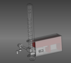

# F-16_SimParts
Parts I designed to build and use in my simulator

  
[wristrest](wristrest)

  
[mapbox](mapbox)

  
[armrest](armrest)

  
[cruholder](cruholder)

  
[backventcover](backventcover)
